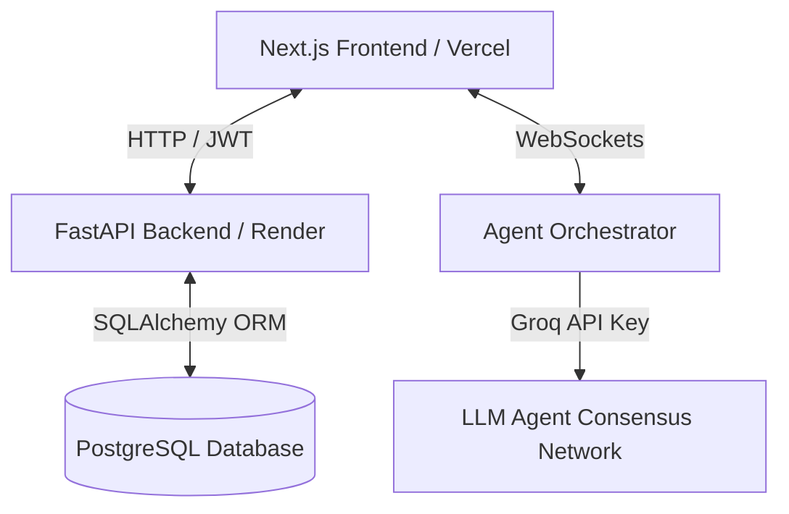

# Archon — Technical Architecture & Interview Preparation Guide

This guide is designed to help you explain **Archon** to technical recruiters, system architects, and software engineers during technical interviews. It covers the core design patterns, architectural trade-offs, and engineering challenges you solved while building the platform.

---

## 💡 The Elevator Pitch

> *"Archon is a collaborative, multi-agent AI systems design platform. It guides developers from a raw product idea to a production-ready, security-audited, and cost-aware cloud architecture. Unlike static diagramming tools (like Draw.io or Lucidchart), Archon integrates a real-time AI interview discovery pipeline to dynamically model system trade-offs, estimate monthly cloud expenditures reactively, perform security audits, and generate infrastructure-as-code exports."*

---

## 🏗️ System Architecture

Archon is designed using a modern decoupled architecture:

### 1. Frontend (Next.js / TypeScript / Tailwind CSS / Zustand)
*   **Hosting:** Vercel Edge Network for rapid static page load and optimal Client-Side Rendering (CSR).
*   **Visual Canvas:** Powered by `@xyflow/react` (React Flow) for rendering nodes (APIs, databases, caches) and connections.
*   **State Management:** Zustand was selected for its minimal footprint, lack of boilerplate, and ease of creating decoupled state slices (e.g., Undo/Redo state stacks).

### 2. Backend (FastAPI / Uvicorn / SQLAlchemy)
*   **Hosting:** Render Web Service containerized using Docker.
*   **API Design:** RESTful endpoints for CRUD operations (auth, project metadata, versions) and async WebSocket connections for real-time streaming data.
*   **ORM:** SQLAlchemy with connection pooling to PostgreSQL.

### 3. Data Store (PostgreSQL)
*   **Why PostgreSQL:** SQLite fallback was explicitly disabled to ensure production-grade transactional isolation, support for concurrent schema modifications, and robust user session storage.

---

## 🛠️ Core Features & Technical Depth (What to Highlight)

### 1. React Flow Canvas Undo/Redo State Management
*   **The Problem:** React Flow state changes rapidly (moving nodes, editing fields). Maintaining a history stack without performance degradation is complex.
*   **The Solution:** Implemented a Command Pattern history system using Zustand:
    *   Maintain two stacks: `past` (undo history) and `future` (redo history).
    *   When a state-mutating action occurs, the current canvas state is pushed to `past`, and `future` is cleared.
    *   To prevent memory bloat, we enforce a maximum history depth (e.g., 20 states).

### 2. Multi-Agent LLM Consensus Network
*   **The Logic:** Instead of using a single prompt to design a system, Archon splits reasoning into specialized agents (Planner, Requirements, Security, Database, Infra).
*   **The Pipeline:** The agents negotiate the structure. A WebSocket connection streams their conversation logs in real-time to a glassmorphic terminal container in the frontend.

### 3. Ingestion & Specification Parser
*   **The Feature:** Users can upload Draw.io XML structure formats, Mermaid `.mmd` diagrams, or plain text spec sheets.
*   **The Pipeline:** FastAPI processes the file asynchronously, extracts structure/dependencies via custom parsing scripts, and passes the context to the multi-agent queue to populate the React Flow canvas instantly.

---

## ❓ Common Technical Interview Questions

#### Q1: "Why did you use multiple agents instead of one LLM?"
> **Answer:** *"A single LLM prompt suffers from context dilution, prompt length limits, and a high rate of architectural hallucinations when designing complex systems. By splitting the problem space into specialized agents (Planner, Requirements, Security, Database, Infra), each agent operates with a constrained, highly focused system instruction set. This separation of concerns mimics a real-world system architecture review board where specialists (e.g., a database engineer and a security lead) debate trade-offs. The result is a much lower error rate and more realistic technology recommendations."*

#### Q2: "How does the orchestrator work?"
> **Answer:** *"The orchestrator is an asynchronous execution coordinator. When a session starts, it loads the project's parameters and controls the agent pipeline. When the user submits requirements, the orchestrator feeds the conversation history to the Planner to draft a design. It then routes that draft to the Database Agent to verify schemas, the Security Agent to run audits, and the Infra Agent to map cloud dependencies. Once consensus is reached, it compiles the final JSON node/edge canvas structure, persists it to PostgreSQL, and broadcasts the status updates."*

#### Q3: "Why WebSockets?"
> **Answer:** *"The discovery interview is an interactive session. Polling the database with HTTP requests introduces latency, increases server overhead, and ruins the real-time console experience. WebSockets establish a single, bi-directional, persistent TCP connection. This allows the backend orchestrator to stream logs instantly as agents execute their tasks (e.g. 'Planner is building nodes...', 'Security is auditing network rules...') and handle incoming user answers with sub-millisecond latency."*

#### Q4: "How is the React Flow canvas synchronized?"
> **Answer:** *"React Flow maintains local UI states for high-frequency user actions like node dragging to guarantee 60fps rendering. If we synced every minor movement instantly to the backend, it would flood the database with write locks. To solve this, we debounce state updates: changes are captured immediately in our local Zustand store for instant undo/redo actions, but the background save to our PostgreSQL database is debounced by 500ms of inactivity, committing only the final node positions and edge graphs."*

#### Q5: "How do you generate Terraform?"
> **Answer:** *"Once the canvas configuration is finalized, the orchestrator maps the components to their respective cloud infrastructure definitions. The Infra Agent parses this JSON node data and matches each component (like an API gateway, ECS service, or RDS Postgres instance) to predefined HCL (HashiCorp Configuration Language) templates. It dynamically injects user-defined variables (such as regions, instance classes, and VPC subnets) to output valid Terraform `.tf` files, which are then bundled and pushed directly to the user's GitHub repository."*

#### Q6: "What was the hardest engineering challenge?"
> **Answer:** *"The hardest challenge was managing state synchronization consistency across three layers: React Flow's local viewport DOM, Zustand's local client history stack (for instant Undo/Redo commands), and the relational PostgreSQL schema. Frequent node drags caused race conditions and database locks on the API. 
> 
> I solved this by decoupling the state updates: 
> 1. React Flow updates the local canvas UI immediately.
> 2. The local changes are recorded instantly in the Zustand `past` history stack to support seamless `Ctrl/Cmd+Z` rollbacks.
> 3. We use a debounced worker that waits for 500ms of drag inactivity before sending the batched coordinate mutations to the FastAPI backend, updating PostgreSQL in a single database transaction. This eliminated database write locks and maintained perfect client-server synchronization."*

