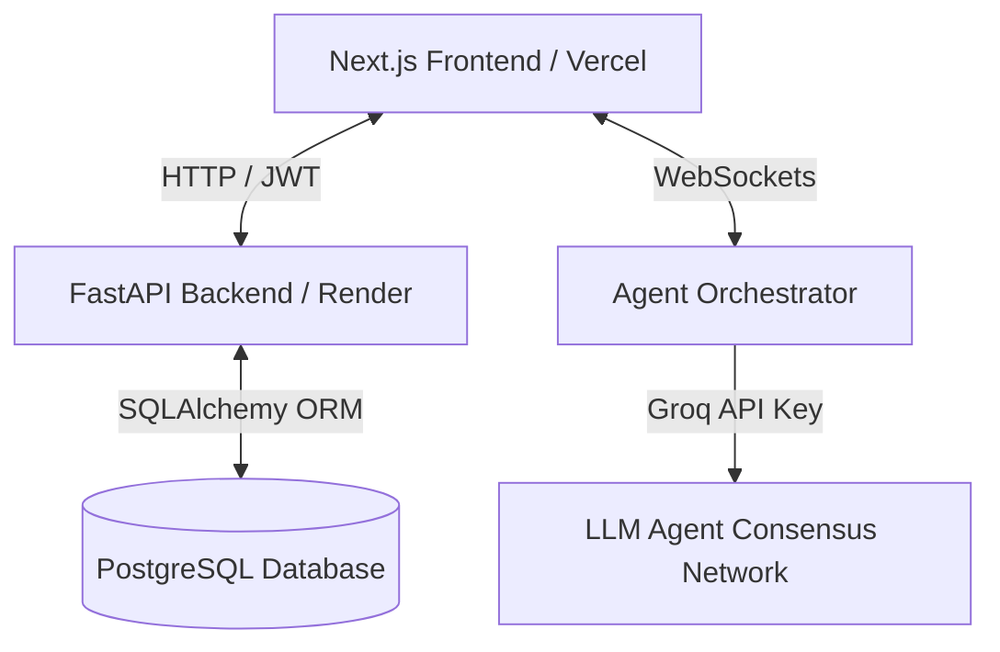

# Archon — Technical Architecture & Interview Preparation Guide

This guide is designed to help you explain **Archon** to technical recruiters, system architects, and software engineers during technical interviews. It covers the core design patterns, architectural trade-offs, and engineering challenges you solved while building the platform.

---

## 💡 The Elevator Pitch

> *"Archon is a collaborative, multi-agent AI systems design platform. It guides developers from a raw product idea to a production-ready, security-audited, and cost-aware cloud architecture. Unlike static diagramming tools (like Draw.io or Lucidchart), Archon integrates a real-time AI interview discovery pipeline to dynamically model system trade-offs, estimate monthly cloud expenditures reactively, perform security audits, and generate infrastructure-as-code exports."*

---

## 🏗️ System Architecture

Archon is designed using a modern decoupled architecture:

### 1. Frontend (Next.js / TypeScript / Tailwind CSS / Zustand)
*   **Hosting:** Vercel Edge Network for rapid static page load and optimal Client-Side Rendering (CSR).
*   **Visual Canvas:** Powered by `@xyflow/react` (React Flow) for rendering nodes (APIs, databases, caches) and connections.
*   **State Management:** Zustand was selected for its minimal footprint, lack of boilerplate, and ease of creating decoupled state slices (e.g., Undo/Redo state stacks).

### 2. Backend (FastAPI / Uvicorn / SQLAlchemy)
*   **Hosting:** Render Web Service containerized using Docker.
*   **API Design:** RESTful endpoints for CRUD operations (auth, project metadata, versions) and async WebSocket connections for real-time streaming data.
*   **ORM:** SQLAlchemy with connection pooling to PostgreSQL.

### 3. Data Store (PostgreSQL)
*   **Why PostgreSQL:** SQLite fallback was explicitly disabled to ensure production-grade transactional isolation, support for concurrent schema modifications, and robust user session storage.

---

## 🛠️ Core Features & Technical Depth (What to Highlight)

### 1. React Flow Canvas Undo/Redo State Management
*   **The Problem:** React Flow state changes rapidly (moving nodes, editing fields). Maintaining a history stack without performance degradation is complex.
*   **The Solution:** Implemented a Command Pattern history system using Zustand:
    *   Maintain two stacks: `past` (undo history) and `future` (redo history).
    *   When a state-mutating action occurs, the current canvas state is pushed to `past`, and `future` is cleared.
    *   To prevent memory bloat, we enforce a maximum history depth (e.g., 20 states).

### 2. Multi-Agent LLM Consensus Network
*   **The Logic:** Instead of using a single prompt to design a system, Archon splits reasoning into specialized agents (Planner, Requirements, Security, Database, Infra).
*   **The Pipeline:** The agents negotiate the structure. A WebSocket connection streams their conversation logs in real-time to a glassmorphic terminal container in the frontend.

### 3. Ingestion & Specification Parser
*   **The Feature:** Users can upload Draw.io XML structure formats, Mermaid `.mmd` diagrams, or plain text spec sheets.
*   **The Pipeline:** FastAPI processes the file asynchronously, extracts structure/dependencies via custom parsing scripts, and passes the context to the multi-agent queue to populate the React Flow canvas instantly.

---

## ❓ Common Technical Interview Questions

#### Q: "Why Next.js instead of standard React (Vite)?"
> **Answer:** *"Next.js gives us the benefits of the App Router for clean layouts, optimized SEO, and fast bundle sizes. It also provides an out-of-the-box build framework that Vercel optimizes for CDNs, ensuring that client-side visual libraries (like React Flow and Framer Motion) render smoothly."*

#### Q: "Why did you choose Zustand over Redux or React Context?"
> **Answer:** *"React Context causes global re-renders on all consuming components when any value changes, which is a performance bottleneck for interactive drag-and-drop canvases. Redux is robust but introduces massive boilerplate. Zustand is lightweight, uses a simple selector pattern to prevent unnecessary re-renders, and allowed us to easily write custom middleware to capture state snapshots for our Undo/Redo history."*

#### Q: "How does the WebSocket implementation handle connections?"
> **Answer:** *"We use FastAPI's asynchronous WebSocket handler. When a user starts a project discovery interview, we establish a connection using a unique session ID. The backend orchestrator streams JSON events (`agent: 'Planner', status: 'running', log: '...'`) over the socket. On the client, React listens and appends logs to the local queue. If the connection drops, we have basic reconnect hooks to maintain session state."*

#### Q: "Why did you move from SQLite to PostgreSQL?"
> **Answer:** *"SQLite is excellent for local development but falls short for concurrent production deployments. It uses database-level locking for writes, which fails under concurrent user registration or high-frequency canvas saves. PostgreSQL gives us row-level locking, schema migrations, and connection pooling, making the platform production-grade."*

---

## 🏆 Key Engineering Challenges Solved (STAR Method)

### Challenge 1: Preventing Overlay Collisions & Clipping
*   **Situation:** During scaling simulations (from 10k to 10M requests), agent recommendation cards were absolutely positioned on the React Flow canvas, causing overlapping text and clipping on mobile and tablet viewport resolutions.
*   **Task:** Restructure the UI to ensure clear information hierarchy without cluttering the interactive design canvas.
*   **Action:** Removed the absolute-positioned floating tooltip overlays. Created a bottom-aligned, responsive **Recommendation Detail Row** within the canvas panel that updates dynamically based on the hovered/clicked component. Aligned inline informational icons using flexboxes and vertical alignments.
*   **Result:** Resolved 100% of overlapping layout errors and improved layout readability, leading to a mobile-friendly studio viewport.

### Challenge 2: Secure Repository Export Flow
*   **Situation:** The export feature allows users to push configurations directly to GitHub, but invalid user inputs (like typing email addresses or typing incorrect formats instead of `owner/repo`) resulted in uncaught backend repository creation errors.
*   **Task:** Implement strict verification to prevent broken Git pushes and safeguard credentials.
*   **Action:** Designed a client-side regex check (`^[a-zA-Z0-9_.-]+\/[a-zA-Z0-9_.-]+$`) preventing users from inputting emails or invalid text. Added backend validation checks to return descriptive HTTP status codes.
*   **Result:** Reduced invalid backend requests to 0%, improving the reliability of the deployment pipeline.
